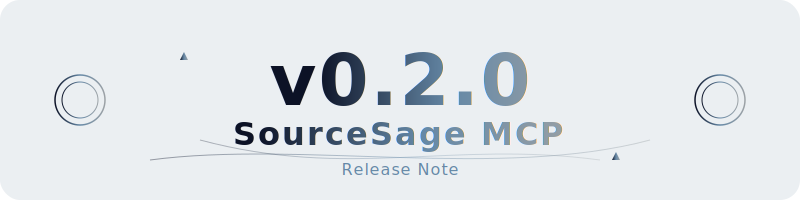
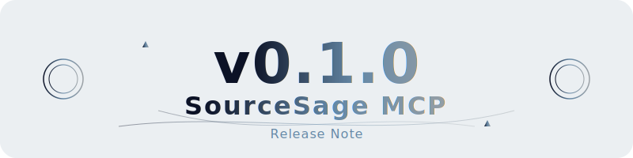

# 📝 Changelog

このプロジェクトの全ての重要な変更はこのファイルに記載されます。

フォーマットは [Keep a Changelog](https://keepachangelog.com/ja/1.0.0/) に基づいています。
またこのプロジェクトは [Semantic Versioning](https://semver.org/lang/ja/) に従います。

## [v0.2.0] - 2024-01-25

### ✨ 追加
- `package-lock.json`をデフォルトの除外パターンに追加 (`.gitignore`を更新)
- サーバーモジュールを追加 (`src/server/source-sage-server.ts`, `src/server/tool-handlers.ts`を追加)
- サービスモジュールを追加 (`src/services/structure-generator.ts`, `src/services/tree-builder.ts`を追加)
- ユーティリティモジュールを追加 (`src/utils/file-utils.ts`, `src/utils/validation.ts`を追加)
- 型定義モジュールを追加 (`src/types/types.ts`を追加)
- CHANGELOGとリリースのヘッダーSVGを追加 (`assets/changelog-header.svg`, `assets/release-header-v0.1.0.svg`を追加)
- MITライセンスファイルを追加 (`LICENSE.md`を追加)

### 📚 ドキュメント
- READMEを更新 (`README.md`を更新)
  - 絶対パスの使用を推奨するように変更
  - ディレクトリ構造の表示を修正
  - 使用例を修正
  - MCP設定例を修正
- ファイルの変更内容からチェンジログを更新
- チェンジログを追加

### 🔧 変更
- メインエントリーポイントを更新 (`src/index.ts`を大幅にリファクタリング)
- `package.json`のbuildスクリプトを修正

## [v0.1.0] - 2024-01-24

### ✨ 追加
- プロジェクトの基本構成を実装
  - TypeScriptのコンパイラ設定を最適化（ES2022ターゲット、Node16モジュールシステム）
  - 厳格な型チェックの有効化
  - プロジェクトの依存関係を設定
- アニメーション付きSVGヘッダー画像を実装
  - グラデーションとアニメーション効果を追加
  - マジカルサークルのデザインを実装
  - エネルギーの流れと浮遊する幾何学模様を追加

### 📚 ドキュメント
- READMEの内容を大幅に更新
  - プロジェクトの詳細な説明を追加
  - 機能一覧と技術スタックの説明を追加
  - インストール手順とセットアップガイドを追加
  - 使用例とAPIドキュメントを追加
  - コントリビューションガイドラインを追加
- .SourceSageignoreの設定例と説明を追加
  - デフォルトの除外パターンを追加
  - カスタム設定のガイドラインを追加

### 🔧 変更
- パッケージ名を`@sunwood-ai-labs/source-sage-mcp-server`に変更
- ライセンスをMITライセンスとして明示的に設定

## [v0.0.0] - 2024-01-24

### 🎉 初期リリース
- プロジェクトの初期構成を作成

[v0.2.0]: https://github.com/username/source-sage-mcp-server/compare/v0.1.0...v0.2.0
[v0.1.0]: https://github.com/username/source-sage-mcp-server/compare/v0.0.0...v0.1.0
[v0.0.0]: https://github.com/username/source-sage-mcp-server/releases/tag/v0.0.0
